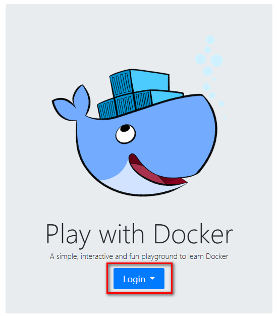
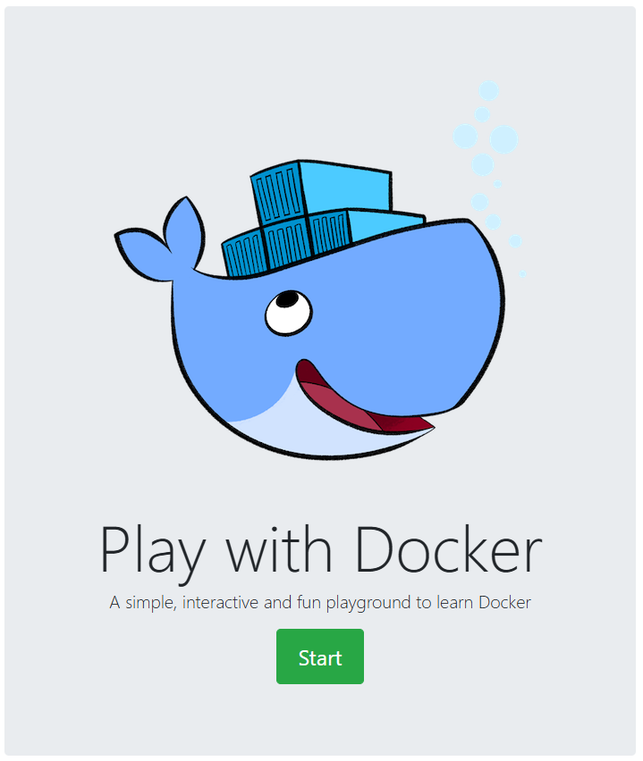
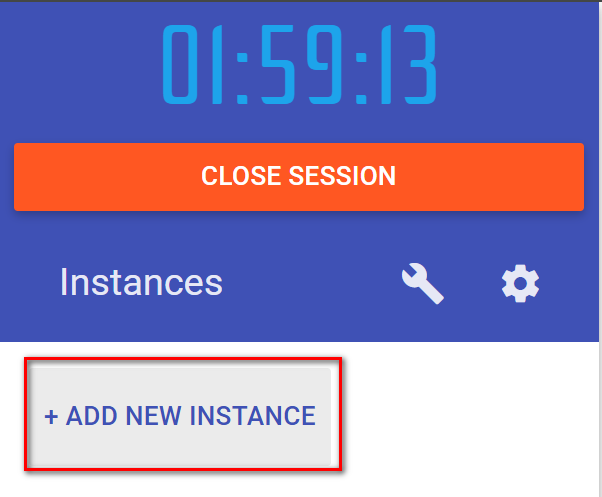
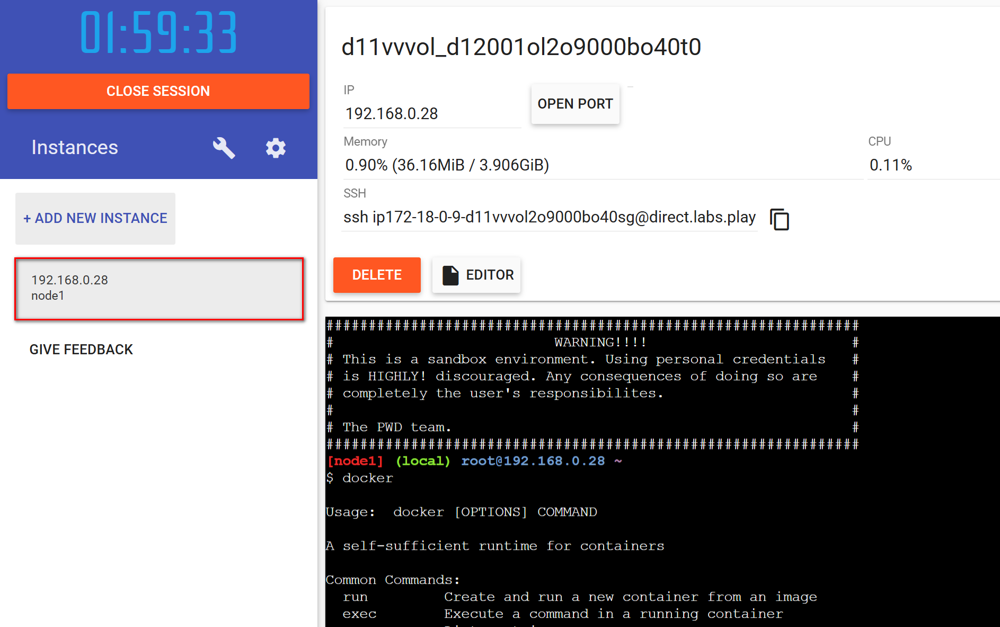
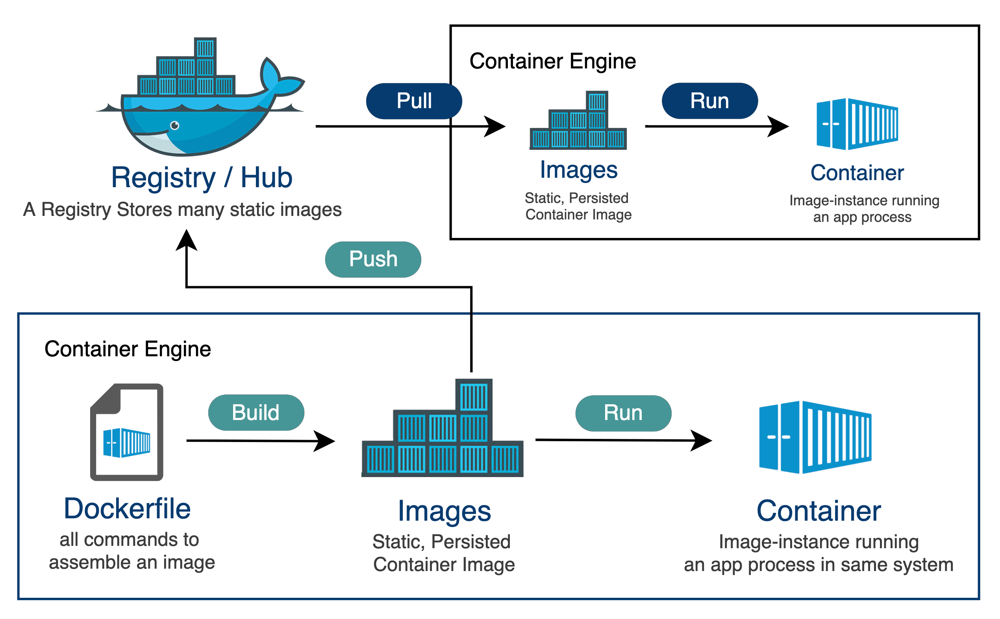

# 基礎 Docker 實作教學(第一部分：快速入門)

課程時間：15 分鐘

- Play with Docker 平台登入與介面熟悉
- Docker 核心概念簡介
  - 容器是什麼？為什麼需要容器？
  - 映像檔、容器、倉庫的基本關係
- 第一個容器運行示範
- 安裝 Git 工具 & [下載範例專案](https://github.com/yourusername/Basic-Docker-practical-tutorial)

---

## Play with Docker 平台登入與介面熟悉

Play with Docker 平台是一個線上 Docker 實驗室，讓你可以在瀏覽器中直接操作 Docker，而無需在本地安裝任何軟體。以下是如何登入和熟悉介面的步驟：

1. **登入 Play with Docker**：
   - 打開瀏覽器，訪問 [Play with Docker](https://labs.play-with-docker.com/)。
   - 點擊「Login」按鈕，使用你的 Docker Hub 帳號登入。如果沒有帳號，可以先註冊一個。
    
   - 點擊「Start」來開始一個新的實驗室會話。
     
   - 建立一個新的實驗室環境，這樣你就可以開始使用 Docker 了。
     <div>
     
     &nbsp;&nbsp;&nbsp;&nbsp;&nbsp;&nbsp;&nbsp;&nbsp;&nbsp;&nbsp;
     
     </div>
---

## Docker 核心概念簡介

### ✨容器是什麼？為什麼需要容器？

在現代 IT 環境中，「容器」已經成為一個不可或缺的技術。它不僅能解決傳統虛擬機（VM）部署的諸多痛點，還能大幅提升開發、測試和部署的效率。今天，我們就來聊聊為什麼學習 Docker 容器技術對我們公司這麼重要，以及它能帶來哪些實際的好處。

#### 1. 傳統 VM 部署的困境

目前公司大多數應用都部署在同一台 VM（虛擬機）上。這樣做有幾個明顯的問題：

- **相依性複雜**：每個應用都需要開發單位手動安裝、維護，容易出現「裝 A 壞 B」的情況。  
- **維運負擔大**：所有軟體都要由開發單位自行安裝與維護，Infra 單位難以協助。
- **升級困難**：如果 VM 的作業系統有安全漏洞，Infra 單位無法直接協助升級，因為一升級可能會影響到同台 VM 上所有應用，風險極高。
- **環境共享問題**：開發人員和測試人員都連到同一個測試環境，彼此之間會互相影響，導致測試不夠獨立與全面，使用上線後常發生「在我這台可以跑」的問題。

#### 2. 容器的優勢

這時候，「容器」就能解決我們遇到的這些痛點：

- **環境隔離**：每個應用都可以打包成一個獨立的容器，彼此不會互相干擾。升級、測試、維護都更容易。
- **快速部署**：容器啟動速度快，開發人員可以很快建立屬於自己的測試環境，不用再搶同一套資源。
- **一致性**：不管在開發、測試還是生產環境，容器內的應用和設定都能保持一致，大幅減少「在我這邊可以跑，在你那邊卻不行」的情況。
- **方便自動化**：配合自動化測試、CI/CD，容器能快速建立、銷毀測試環境，提升開發效率和品質。
- **為 K8S 打基礎**：公司未來要全面導入 Kubernetes（K8S），而 Docker 容器正是 K8S 的基礎單位，學會 Docker 就是邁向雲原生的第一步！

#### 3. 總結

簡單來說，容器技術能幫助我們：

- 降低維運與升級的風險
- 提升開發與測試的效率
- 為未來的自動化與 K8S 打下堅實基礎

所以，學會 Docker，不只是跟上技術潮流，而是解決現有開發與維運痛點的關鍵工具。透過 Docker，我們能讓開發、測試、上線流程更現代化、更高效率，減少人為錯誤與維運負擔，**讓開發人員專注在創新，而不是環境設定與相依性問題**。學會 Docker，不僅能跟上公司技術轉型的腳步，也能大幅提升團隊的協作與穩定性，讓日常工作變得更輕鬆順暢！💪

### ✨映像檔、容器、倉庫的基本關係

映像檔（image）、容器（container）和倉庫（repository）是Docker 生態系統中三個關鍵的概念，它們之間存在著密切的關係。 映像檔是容器的基礎，容器是從映像檔創建的執行環境，而倉庫則是用於儲存和分發映像檔的地方。
具體來說：

<div align=center>

</div>

#### Dockerfile

Dockerfile 是一個文本檔案，包含了一系列指令，用於定義如何構建一個 Docker 映像檔。它描述了從哪個基礎映像開始、需要安裝哪些軟體、如何配置環境等。通過執行 `docker build` 命令，可以根據 Dockerfile 生成一個新的映像檔。

#### 映像檔（Image）

映像檔是一個只讀的模板，包含了應用程式、作業系統、運行環境等。 可以將其看作是一個完整的軟體包，包含了運行應用程式所需的一切。

#### 容器（Container）

容器是從映像檔創建的執行實例。 它將映像檔中的內容隔離起來，形成一個獨立的執行環境。 容器可以理解為一個運行中的應用程式，基於映像檔，並且擁有自己的檔案系統和資源配置。

#### 倉庫（Repository）

倉庫是儲存和分發映像檔的地方。 它可以是一個公共的伺服器，例如 [Docker Hub](https://hub.docker.com/)，也可以是[私有的伺服器](https://harbor.wneweb.com.tw/)。 倉庫允許用戶上傳、下載和分享映像檔，使得映像檔可以被其他人使用。

---

## 第一個容器運行示範

IT 傳統就是建立一個「Hello World」的範例來介紹新技術，Docker 也不例外。接下來，我們將在 Play with Docker 平台上運行第一個容器，並了解其基本概念。

Play with Docker 的終端機中輸入以下命令來運行第一個容器：

```bash
docker run hello-world
```

它的作用是從 [Docker Hub](https://hub.docker.com/_/hello-world) 下載一個名為 `hello-world` 的映像檔，並在容器中運行它。這個映像檔會顯示一條簡單的歡迎訊息，證明 Docker 已經正確安裝並能正常運行。

如果你看到以下訊息，恭喜你，Docker 已經成功運行了！

```bath
Hello from Docker!
This message shows that your installation appears to be working correctly.

To generate this message, Docker took the following steps:
 1. The Docker client contacted the Docker daemon.
 2. The Docker daemon pulled the "hello-world" image from the Docker Hub.
    (amd64)
 3. The Docker daemon created a new container from that image which runs the
    executable that produces the output you are currently reading.
 4. The Docker daemon streamed that output to the Docker client, which sent it
    to your terminal.

To try something more ambitious, you can run an Ubuntu container with:
 $ docker run -it ubuntu bash

Share images, automate workflows, and more with a free Docker ID:
 https://hub.docker.com/

For more examples and ideas, visit:
 https://docs.docker.com/get-started/
```
